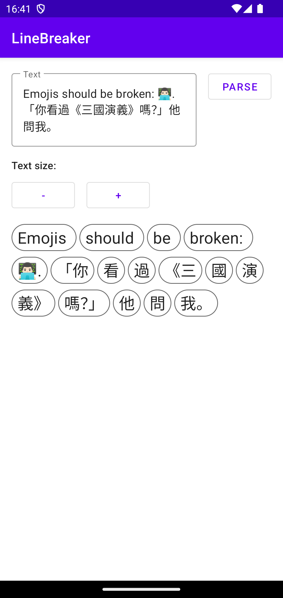
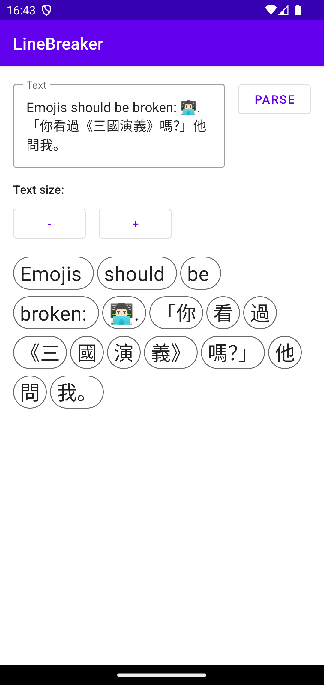

# linebreak-android

[](https://jitpack.io/#cn.gavinliu/linebreak-android)

> `linebreak-android` based on [libunibreak](https://github.com/adah1972/libunibreak)

## How to look ?

| Screenshot                              | Screenshot               | Screenshot               |
|-----------------------------------------| ------------------------ | ------------------------ |
|  |  |  |

## How to use ?

### Add dependency

```gradle
allprojects {
	repositories {
		...
		maven { url 'https://jitpack.io' }
	}
}
```

```gradle
dependencies {
    implementation 'cn.gavinliu:linebreak-android:x.y.z'
}
```

### Kotlin extension

```Kotlin
fun String.lineBreak() = LineBreaker.lineBreak(this)
```

### Simple Usage

```Kotlin
val result = String.lineBreak()
```
