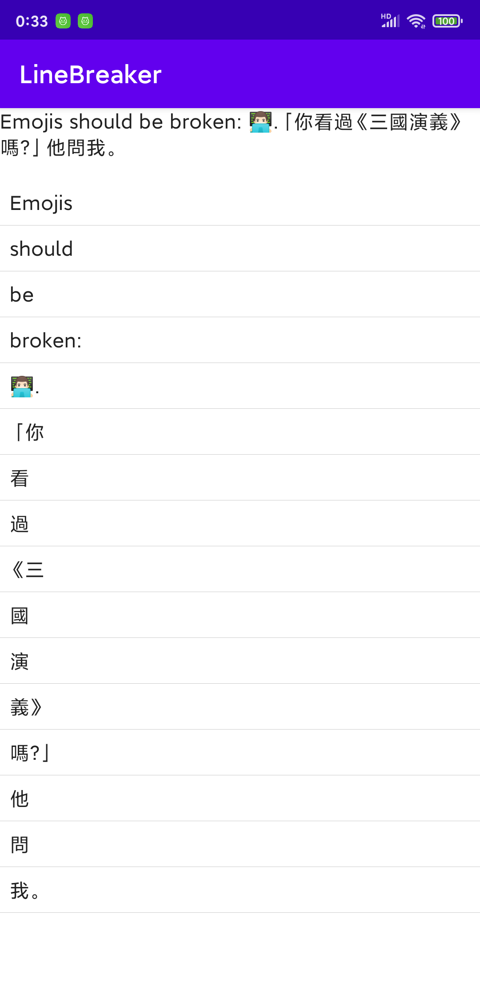

# linebreak-android

> `linebreak-android` based on [libunibreak](https://github.com/adah1972/libunibreak)

## How to look ?

| Screenshot               | Screenshot               | Screenshot               |
| ------------------------ | ------------------------ | ------------------------ |
|  |  |  |

## How to use ?

### Kotlin extension

```Kotlin
fun String.lineBreak() = LineBreaker.lineBreak(this)
```

### Simple Usage

```Kotlin
val result = String.lineBreak()
```
